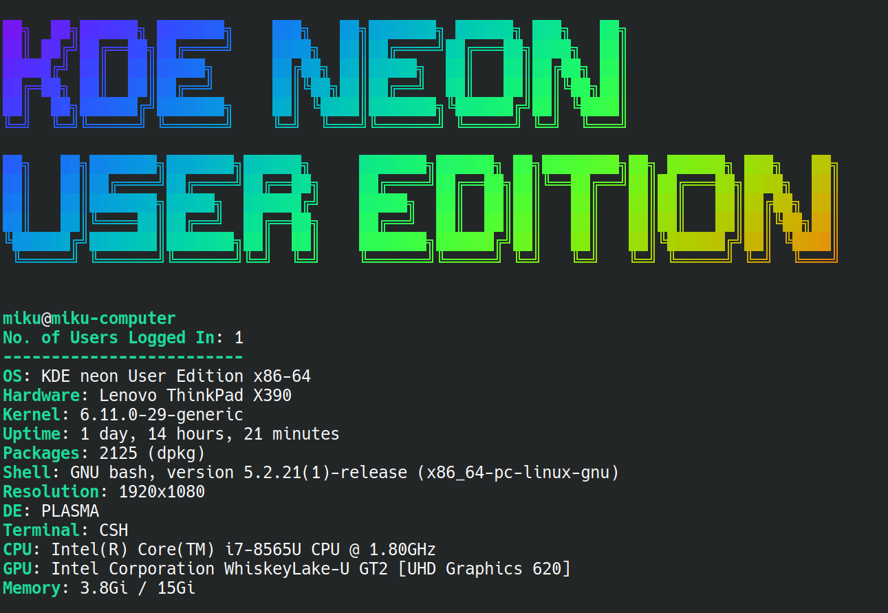

# system-info-tool

A minimal neofetch-like CLI tool built in Bash to display essential system information with a colorful ASCII art banner of your distro name using **figlet** and **lolcat**.

---
# Output


---

## Features

- Colorful ASCII art distro banner (figlet + lolcat)
- OS, kernel, and uptime info
- Package count (dpkg-based)
- Shell version and terminal
- CPU, GPU, and memory usage
- Works on most Linux distros

---

## Requirements

This script depends on a few common CLI tools:

- `bash`
- `figlet` – for ASCII banner
- `lolcat` – for colorizing text
- `uname`, `uptime`, `dpkg`, `lscpu`, `lspci`, `free`, etc.

> 🔧 Install required tools:
```bash
sudo apt install figlet lolcat
cp "ANSI Shadow.flg" /usr/share/figlet or /usr/local/share/figlet
```
# Author

Made with ❤ by Hammad
🔗 GitHub: @hammad-013
